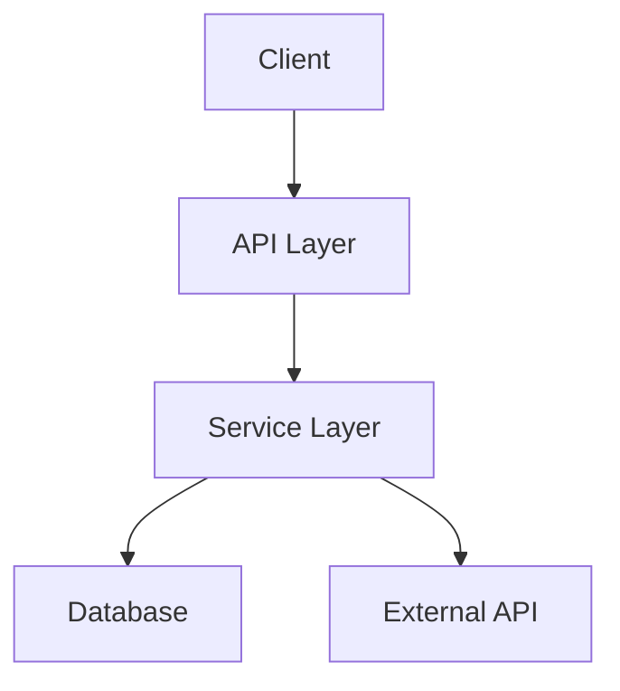

# Design Documentation

This is phase 2 of spec-driven development. Requirements tell me what to build. Design tells me how.

## When to Use This

- Requirements phase is complete and validated
- You need a technical plan before writing code
- The feature involves architectural decisions worth documenting
- Multiple components need to interact

## Design Document Structure

Every design doc I produce follows this structure:

```markdown
# Design Document: [Feature Name]

## Overview
[What we're building and the high-level approach]

## Architecture
[How the system is structured, component relationships]

## Components and Interfaces
[What each component does, what goes in, what comes out]

## Data Models
[Data structures, validation rules, relationships]

## Error Handling
[What can go wrong and how we handle it]

## Testing Strategy
[How we'll verify this works]
```

## How I Work Through Design

### 1. Understand the Requirements First

Before designing anything, I re-read the requirements and identify:
- What are the core behaviors?
- What are the constraints (performance, security, scale)?
- What existing systems does this touch?
- What could go wrong?

### 2. Define the Architecture

I describe the high-level structure — components and how they relate. I use diagrams when they add clarity:



I keep architecture descriptions focused on what matters for this feature. I don't redocument the entire system — just the parts this feature touches or changes.

### 3. Specify Components and Interfaces

For each component, I define:
- Purpose (one sentence — if it takes more, the component is doing too much)
- Responsibilities (what it owns)
- Interface (inputs, outputs, dependencies)

```typescript
interface UserService {
  getUser(id: string): Promise<User>;
  updateUser(id: string, data: Partial<User>): Promise<User>;
  deleteUser(id: string): Promise<void>;
}
```

I define interfaces before implementations. This lets me reason about component boundaries without getting lost in details.

### 4. Define Data Models

For each entity:

| Field | Type | Required | Validation |
|-------|------|----------|------------|
| id | UUID | Yes | Auto-generated |
| email | string | Yes | RFC 5322 format |
| name | string | Yes | 2-100 characters |
| createdAt | timestamp | Yes | Auto-set |

I include validation rules here because they affect both the API layer and the database layer. Better to define them once in design than discover inconsistencies during implementation.

### 5. Plan Error Handling

I categorize errors and define how each is handled:

| Error Type | HTTP Code | User Message | System Action |
|------------|-----------|--------------|---------------|
| Validation | 400 | Specific field errors | Log, return details |
| Auth | 401/403 | "Not authorized" | Log, redirect |
| Not Found | 404 | "Resource not found" | Log |
| Server | 500 | "Something went wrong" | Log, alert, retry if safe |

I don't just plan for the happy path. Every external call can fail. Every user input can be wrong. Every database query can timeout.

### 6. Define Testing Strategy

I specify what gets tested at each layer:
- Unit tests for business logic and validation
- Integration tests for API endpoints and data access
- E2E tests for critical user flows only (these are expensive to maintain)

I don't specify exact test cases in design — that's implementation detail. I specify the testing approach and coverage expectations.

## Decision Documentation

When I make a non-obvious technical choice, I document it:

```markdown
### Decision: [Title]

**Context:** [Why this decision came up]

**Options Considered:**
1. [Option A] — Pros: [benefits] / Cons: [drawbacks]
2. [Option B] — Pros: [benefits] / Cons: [drawbacks]

**Decision:** [What I chose]
**Rationale:** [Why — this is the most important part]
```

The rationale matters more than the decision itself. Six months from now, someone will want to know why we chose approach A over B. If the rationale is documented, they can evaluate whether it still holds.

## Principles I Follow

**Design for current requirements, not hypothetical futures.** Over-engineering is a bigger risk than under-engineering. You can extend a clean, simple design. You can't simplify an over-engineered one without rewriting it.

**Make interfaces explicit.** If two components talk to each other, the contract between them should be defined. Implicit interfaces become bugs.

**Address non-functional requirements.** Performance, security, and scalability aren't afterthoughts. If the requirements specify "response within 200ms," the design needs to explain how that's achieved.

**Keep it proportional.** A simple feature gets a simple design. Don't write 10 pages of architecture for a CRUD endpoint. Match the design depth to the feature complexity.

## Quality Checklist

Before moving to tasks:
- [ ] Every requirement has a corresponding design element
- [ ] Component responsibilities are clear and non-overlapping
- [ ] Interfaces between components are defined
- [ ] Data models cover all entities with validation rules
- [ ] Error handling covers expected failure modes
- [ ] Security considerations are addressed
- [ ] Testing strategy is defined
- [ ] Key decisions are documented with rationale

## What Comes Next

Once design is reviewed and approved:
1. Move to Task Planning phase
2. Break the design into sequenced implementation tasks
3. Each task will reference both design components and requirements
